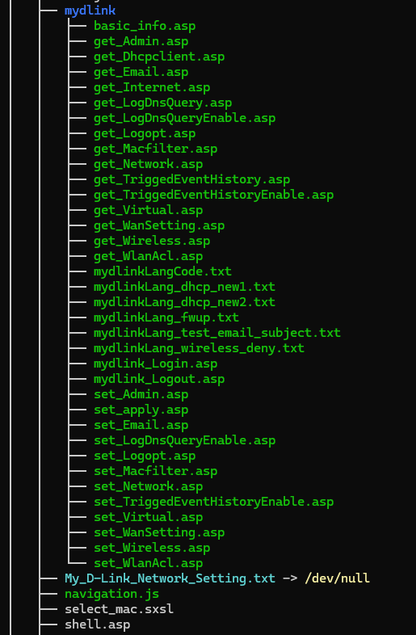
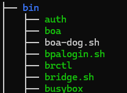
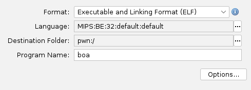

#### 1. Introduction

Ce projet consiste en la documentation du processus d'analyse d'un firmware, l'extraction de son système de fichiers ainsi qu'à l'identification d'une vulnérabilité RCE par injection de commande via reverse engineering puis enfin à son exploitation grâce à l'émulation.

Nous allons ainsi nous servir du firmware d'un routeur grand public : le D-Link DIR-605L (Firmware v1.13).

#### 2. Vecteur d'attaque

La vulnérabilité étudiée se trouve ici dans la gestion des requêtes HTTP par le serveur web embarqué du routeur. Lorsqu'un utilisateur interagit avec la page de diagnostic contenant différentes fonctions telles que la vérification réseau via la commande ping, le serveur web récupère l'adresse IP entrée par l'utilisateur.

La faille réside dans l'assemblage de la commande shell (ex: ```ping -c 1 [IP_UTILISATEUR]```), le programme assemble une chaîne de caractères en mémoire au lieu d'utiliser des API système isolées. Celui-ci transmet ensuite la chaîne à un interpreteur de commandes via la fonction system().

Une injection de commande devient alors possible si l'entrée n'est pas nettoyée, un attaquant peut insérer des opérateurs logiques shell (```; , && , |```) afin de forcer le routeur à exécuter des commandes arbitraires avec les privilèges root.

#### 3. Extraction du firmware et analyse de la structure

Avant toute analyse du binaire du serveur web, il faut tout d'abord l'éxtraire de l'image globale du firmware (.bin). Pour se faire, nous utilisons donc un outil connu et simple d'utilisation appelé **Binwalk**. Cet outil permet l'extraction de données basée sur les signatures et les headers en recherchant les magic numbers.

`binwalk -eM dir605L_FW_113.bin`

* -e (Extract) : extrait automatiquement chaque composant identifié en fonction de son type.
* -M (Matryoshka) : Utilise l'extraction récursive. Si l'un des fichiers contient lui-même des archives compressées ou d'autres packages, binwalk continuera d'extraire ces fichiers.

Il est possible que binwalk renvoie une erreur de type :

```WARNING: Extractor.execute failed to run external extractor 'sasquatch -p 1 -le -d 'squashfs-root' '%e'': [Errno 2] No such file or directory: 'sasquatch', 'sasquatch -p 1 -le -d 'squashfs-root' '%e'' might not be installed correctly```

Les constructeurs modifient souvent le format standard du système de fichiers SquashFS pour des raisons d'optimisations ou d'obfuscation, il est donc important d'avoir un outil permettant de lire ces version modifiées. Il existe donc un outil nommé **sasquatch** permettant de forcer l'ouverture de ces formats.

Une fois l'outil installé nous pouvons donc relancer la commande binwalk qui ne renvoie cette fois-ci aucune erreur, les avertissements présents ne sont pas importants :

* Avertissements de liens symboliques : Pour des raisons de sécurité, binwalk refuse de créer des liens qui pointent en dehors du repértoire de travail, il les redirige ainsi vers /dev/null afin d'éviter que l'extraction ne vienne écraser les fichiers de notre propre système.
* Avertissement sur le kernel : binwalk a tenté de chercher des fichiers à l'intérieur de celui-ci, comme il n' y a pas de système de fichiers à l'intérieur du kernel, il affiche qu'il n'a rien pu extraire.

Nous allons maintenant nous intéresser au système de fichiers, ici **squashfs-root-0**



En se servant de la commande **tree** nous pouvons apercevoir dans la partie dossier ` web/` un dossier appelé `mydlink/` contenant différents fichiers au format `.asp`, les fichiers possédant cette extension sont des fichiers Active Server Page, ce sont des documents web qui peuvent contenir des codes HTML, textes, graphiques et XML, ainsi ces fichiers serveur ne possèdent aucun code classique mais une directive côté serveur. Le vrai code de ces fichiers est donc compilé à l'intérieur du binaire du serveur web.

Le contenu du fichier `set_admin.asp` pour simple exemple est un simple formulaire HTML, qui envoie ses donnéesà une URL spécifique : `/goform/form_admin` :

```
<html>
<head>
</head>
<body>
<form name="myform" action="/goform/form_admin" method="post">
<input type="text" name="settingsChanged" value="1"/>
<input type="text" name="config.web_server_allow_wan_http" value="1"/>
<input type="text" name="config.web_server_wan_port_http" value="1"/>

<input type="submit" value="Submit" />
</form>
</body>
</html>
```

Nous allons donc maintenant nous pencher du côté du dossier contenant les différents binaires, c'est-à-dire `bin/`,

En déroulant les différents binaires présents nous tombons directement sur le binaire faisant tourner le serveur web : `boa`.

Boa est un serveur web open source très léger, beaucoup utilisé dans les routeurs au début des années 2000-2010. Les constructeurs y ajoutaient en général des modifications pour supporter les scrtips ASP et les formulaires, créeant ainsi des failles d'exploitation.



Nous pouvons aussi noter la présence de `boa-dog.sh`, qui est un script **"Watchdog"** chargé de surveiller le processus `boa` et de le relancer s'il plante.

Comme attendu le firmware du routeur se sert d'une architecture MIPS 32-bits, la particularité des architectures MIPS est l'endianness différente. En effet la grande majorité des architectures telles que x86_64, x86, ARM ou encore RISC-V sont en little endian, c'est-à-dire que la lecture des bits se fait du bits de poids faible vers le bit de poids fort (ex :` ici l'adresse 0xcafebabe se lira : 0xbe, 0xba, 0xfe, 0xca`)

L'architecture MIPS est donc différente, elle est en big endian, ainsi les bits sont lus du bit de poids fort vers le bit de poids faible, il est possible d'obtenir quelques informations sur le binaire en se servant de la commande native **file** :

`file bin/boa bin/boa: ELF 32-bit MSB executable, MIPS, MIPS-I version 1 (SYSV), dynamically linked, interpreter /lib/ld-uClibc.so.0, no section header`

MSB ici signifiant donc Most Significant Bit.

#### Reverse Engineering du serveur web et cartographie des fonctions sensibles via Ghidra

Nous allons donc nous servir de l'outil Ghidra qui permet de désassembler le code Assembleur du binaire pour le retranscrire du mieux possible en pseudocode C, Ghidra offre aussi une multitude d'outils permettant une facilitation de la manipulation du binaire.

Grâce aux informations récupérées précédemment via la commande **file** nous pouvons donc ouvrir le binaire avec Ghidra en y rentrant les bonnes informations :



Nous choisissons donc ici comme langage : MIPS 32 - bits utilisant le format MSB par défaut.

Ici une première chose importante et avantageuse pour nous est le non strippage des symboles, en effet lors de la compilation en binaire, il est possible d'indiquer le strippage des symboles, les rendant ainsi illisibles pour complexifier la lecture du binaire via un désassembleur. Dans notre cas, le serveur web boa n'a pas été compilé avec l'option stripped.

Une fois le chargement du binaire terminé, nous retrouvons donc directement une fonction **main** contenant le code principal du programme :

```

undefined4 main(int param_1,char **param_2)

{
  undefined *puVar1;
  int iVar2;
  FILE *pFVar3;
  __pid_t _Var4;
  size_t __size;
  int iVar5;
  char *__s;
  code *pcVar6;
  char acStack_30 [24];
  
  umask(0x3f);
  time(&current_time);
  websAspInit(param_1,param_2);
  tzset();
  iVar2 = open("/dev/null",0);
  dup2(iVar2,0);
  close(iVar2);
LAB_00408888:
  do {
    while( true ) {
      while( true ) {
        iVar2 = getopt(param_1,param_2,"c:dl:f:r:");
        if (iVar2 == -1) {
          if ((server_root == (char *)0x0) &&
             (server_root = strdup("/etc/boa"), server_root == (char *)0x0)) {
            __s = "strdup (SERVER_ROOT)";
            goto LAB_004087e4;
          }
          iVar2 = chdir(server_root);
          puVar1 = PTR_DAT_004e6778;
          if (iVar2 == -1) {
            fprintf(stderr,"Could not chdir to \"%s\": aborting\n",server_root);
            goto LAB_004087ec;
          }
          read_config_files();
          create_common_env();
          iVar2 = socket(2,2,6);
          fcntl(iVar2,4,0x80);
          fcntl(iVar2,2,1);
          setsockopt(iVar2,0xffff,4,PTR_DAT_004e6778 + 0x5104,4);
          bind_server(iVar2,server_ip,server_port);
          listen(iVar2,backlog);
          build_needs_escape();
          init_version_info();
          create_version_file();
          create_chklist_file(0);
          update_language_status();
          pcVar6 = fork;
          if (*(int *)(puVar1 + 0x5100) == 0) {
            pcVar6 = getpid;
          }
          iVar5 = (*pcVar6)();
          if (iVar5 == -1) {
            __s = "fork/getpid";
            goto LAB_004087e4;
          }
          if (iVar5 != 0) {
            if (pid_file != (char *)0x0) {
              pFVar3 = fopen(pid_file,"w");
              if (pFVar3 == (FILE *)0x0) {
                perror("fopen pid file");
              }
              else {
                fprintf(pFVar3,"%d",iVar5);
                fclose(pFVar3);
              }
            }
            iVar5 = 0;
            if (*(int *)(puVar1 + 0x5100) != 0) goto LAB_00408b98;
          }
          _Var4 = getpid();
          sprintf(acStack_30,"%d\n",_Var4);
          pFVar3 = fopen(web_pidfile,"w");
          if (pFVar3 != (FILE *)0x0) {
            __size = strlen(acStack_30);
            fwrite(acStack_30,__size,1,pFVar3);
            fclose(pFVar3);
          }
          boa_start = 1;
          init_signals();
          server_gid = getgid();
          server_uid = getuid();
          timestamp();
          DAT_004e7364 = 0;
          status = 0;
          start_time = current_time;
          loop(iVar2);
          return 0;
        }
        if (iVar2 != 100) break;
        *(undefined4 *)(PTR_DAT_004e6778 + 0x5100) = 0;
      }
      if (100 < iVar2) break;
      if (iVar2 != 99) {
LAB_0040885c:
        fprintf(stderr,"Usage: %s [-c serverroot] [-d] [-f configfile] [-r chroot]%s\n",*param_2,
                &DAT_0048ec60);
        goto LAB_004087ec;
      }
      if (server_root != (char *)0x0) {
        free(server_root);
      }
      server_root = strdup(optarg);
      if (server_root == (char *)0x0) {
        __s = "strdup (for server_root)";
        goto LAB_004087e4;
      }
    }
    if (iVar2 == 0x66) {
      config_file_name = optarg;
      goto LAB_00408888;
    }
    if (iVar2 != 0x72) goto LAB_0040885c;
    iVar2 = chdir(optarg);
    if (iVar2 == -1) {
      __s = "chdir (to chroot)";
      goto LAB_004087e4;
    }
    iVar2 = chroot(optarg);
    if (iVar2 == -1) {
      __s = "chroot";
      goto LAB_004087e4;
    }
    iVar2 = chdir("/");
    if (iVar2 == -1) {
      __s = "chdir (after chroot)";
LAB_004087e4:
      perror(__s);
LAB_004087ec:
      iVar5 = 1;
LAB_00408b98:
                    /* WARNING: Subroutine does not return */
      exit(iVar5);
    }
  } while( true );
}


```

Ainsi il est possible directement d'apercevoir une fonction appelée `websAspInit()`, cette fonction permet l'initialisation des routes des fichiers .asp, nous pouvons le confirmer en ouvrant cette fonction :

```

void websAspInit(void)

{
  int iVar1;
  char local_20;
  char local_1f;
  char local_1e;
  char local_1d;
  
  memset(&local_20,0,0x10);
  root_temp = 0;
  DAT_004e738c = 0;
  websFormDefine("formSetHNAP11",formSetHNAP11);
  websFormDefine("formDeviceReboot",formDeviceReboot);
  websFormDefine("formTcpipSetup",formTcpipSetup);
  websFormDefine("formLanSetupRouterSettings",formLanSetupRouterSettings);
  websFormDefine("formSetWanNonLogin",formSetWanNonLogin);
  websFormDefine("formSetWanPPPoE",formSetWanPPPoE);
  websFormDefine("formSetWanPPTP",formSetWanPPTP);
  websFormDefine("formSetWanL2TP",formSetWanL2TP);
  websFormDefine("formSetWanDhcpplus",formSetWanDhcpplus);
  websFormDefine("formSetFactory",formSetFactory);
  websFormDefine("formSetEasy_Wizard",formSetEasy_Wizard);
  websFormDefine("formdumpeasysetup",formdumpeasysetup);
  websFormDefine("formSetPassword",formSetPassword);
  websFormDefine("formSetRestorePrev",formSetRestorePrev);
  websFormDefine("formFirmwareUpgrade",formFirmwareUpgrade);
  websFormDefine("formLanguageChange",formLanguageChange);
  websFormDefine("formWlanSetup",formWlanSetup);
  websFormDefine("formWlanSetup_Wizard",formWlanSetup_Wizard);
  websFormDefine("formWlanWizardSetup",formWlanWizardSetup);
  websFormDefine("formAdvanceSetup",formAdvanceSetup);
  websFormDefine("formWlanGuestSetup",formWlanGuestSetup);
  websFormDefine("formMydlinkWizardRegister",formMydlinkWizardRegister);
  websFormDefine("form_wireless",form_wireless);
</style>

  websFormDefine("form_network",form_network);
  websFormDefine("form_macfilter",form_macfilter);
  websFormDefine("form_wlan_acl",form_wlan_acl);
  websFormDefine("form_admin",form_admin);
  websFormDefine("form_portforwarding",form_portforwarding);
  websFormDefine("form_apply",form_apply);
  websFormDefine("form_mydlink_sign",form_mydlink_sign);
  websFormDefine("form_login",form_login);
  websFormDefine("form_logout",form_logout);
  websFormDefine("form_wansetting",form_wansetting);
  websFormDefine("form_emailsetting",form_emailsetting);
  websFormDefine("form_mydlink_log_opt",form_mydlink_log_opt);
  websFormDefine("form_log_dnsquery_enable",form_log_dnsquery_enable);
  websFormDefine("form_triggedevent_history_enable",form_triggedevent_history_enable);
  websFormDefine("formLogDnsquery",formLogDnsquery);
  websFormDefine("formSetACLFilter",formSetACLFilter);
  websFormDefine("formMydlinkUpgrade",formMydlinkUpgrade);
  websAspDefine("ACLFilter_List",ACLFilter_List);
  websAspDefine("get_mydlink_state_result",get_mydlink_state_result);
  websFormDefine("formEasySetupLangWizard",formEasySetupLangWizard);
  websFormDefine("formLogin",formLogin);
  websFormDefine("formSetEmail",formSetEmail);
  websFormDefine("formSetLog",formSetLog);
  websFormDefine("formVirtualServ",formVirtualServ);
  websFormDefine("formSchedule",formSchedule);
  websFormDefine("formSetMACFilter",formSetMACFilter);
  websFormDefine("formAdvNetwork",formAdvNetwork);
  websFormDefine("formAdvFirewall",formAdvFirewall);
  websFormDefine("formSetDDNS",formSetDDNS);
  websFormDefine("formSysCmd",formSysCmd);
  websFormDefine("formSetNTP",formSetNTP);
  websFormDefine("formSetNTP_Ajax",formSetNTP_Ajax);
  websFormDefine("formSetRoute",formSetRoute);
  websFormDefine("formSetEnableWizard",formSetEnableWizard);
  websFormDefine("formEasySetupWizard",formEasySetupWizard);
  websFormDefine("formEasySetupWizard2",formEasySetupWizard2);
  websFormDefine("formEasySetupWizard3",formEasySetupWizard3);
  websFormDefine("formEasySetupWWConfig",formEasySetupWWConfig);
  websFormDefine("formEasySetPassword",formEasySetPassword);
  websFormDefine("formEasySetTimezone",formEasySetTimezone);
  websFormDefine("formSetWizard2",formSetWizard2);
  websFormDefine("formSetWizardSelectMode",formSetWizardSelectMode);
  websFormDefine("formAutoDetecWAN_wizard4",formAutoDetecWAN_wizard4);
  websFormDefine("formSetWAN_Wizard51",formSetWAN_Wizard51);
  websFormDefine("formSetWAN_Wizard52",formSetWAN_Wizard52);
  websFormDefine("formSetWAN_Wizard534",formSetWAN_Wizard534);
  websFormDefine("formSetWAN_Wizard55",formSetWAN_Wizard55);
  websFormDefine("formSetWAN_Wizard56",formSetWAN_Wizard56);
  websFormDefine("formSetWAN_Wizard7",formSetWAN_Wizard7);
  websFormDefine("formSetDomainFilter",formSetDomainFilter);
  websFormDefine("formSetQoS",formSetQoS);
  websFormDefine("formSetPortTr",formSetPortTr);
  websFormDefine("formLanguageUpgrade",formLanguageUpgrade);
  websFormDefine("formResetStatistic",formResetStatistic);
  websFormDefine("formSetWizard1",formSetWizard1);
  websFormDefine("formSetWANType_Wizard5",formSetWANType_Wizard5);
  websFormDefine("formWlSiteSurvey",formWlSiteSurvey);
  websFormDefine("formWPS",formWPS);
  websAspDefine("start_wps",start_wps);
  websAspDefine("get_wlan_clients",get_wlan_clients);
  websFormDefine("formSetDHCPResrvRule",formSetDHCPResrvRule);
  websAspDefine("formGetHNAP11",formGetHNAP11);
  websAspDefine("getWanConnection",getWanConnection);
  websAspDefine("getStaticRouteInfo",getStaticRouteInfo);
  websAspDefine("getInfo",getInfo);
  websAspDefine("getIndexInfo",getIndexInfo);
  websAspDefine("AspEcho",AspEcho);
  websAspDefine("dumpAttachedDevice",dumpAttachedDevice);
  websAspDefine("dumplog",dumplog);
  websAspDefine("dumpeasysetup",dumpeasysetup);
  websAspDefine("getStatistic",getStatistic);
  websAspDefine("getLogout",getLogout);
  websAspDefine("sysCmdLog",sysCmdLog);
  websAspDefine("staticRouteList",staticRouteList);
  websAspDefine("dhcpRsvdIp_List",dhcpRsvdIp_List);
  websAspDefine("MACFilter_List",MACFilter_List);
  websAspDefine("qosList",qosList);
  websAspDefine("DOMAINFilter_List",DOMAINFilter_List);
  websAspDefine("firewallRule_row",firewallRule_row);
  websAspDefine("wlWdsList",wlWdsList);
  websAspDefine("getWizardInformation",getWizardInformation);
  websAspDefine("getFeatureMark",getFeatureMark);
  websAspDefine("dumpVirtualServList",dumpVirtualServList);
  websAspDefine("dumpPortFwList",dumpPortFwList);
  websAspDefine("dhcpRsvdIp_PerInfo",dhcpRsvdIp_PerInfo);
  websAspDefine("virtualServList",virtualServList);
  websAspDefine("scheduleRuleList",scheduleRuleList);
  websAspDefine("virSevSchRuleList",virSevSchRuleList);
  websAspDefine("triggporList",triggporList);
  websAspDefine("getLangInfo",getLangInfo);
  websAspDefine("get_ddns",get_ddns);
  websAspDefine("dnsquery",dnsquery);
  websAspDefine("get_pingdns_resolv",get_pingdns_resolv);
  websAspDefine("get_ping_result",get_ping_result);
  websAspDefine("get_wan_state_result",get_wan_state_result);
  websAspDefine("wan_button_action",wan_button_action);
  websAspDefine("get_igmpgroup",get_igmpgroup);
  websAspDefine("get_InternetSessions",get_InternetSessions);
  websAspDefine("wlSiteSurveyTbl",wlSiteSurveyTbl);
  websAspDefine("show_ntp_tmp",show_ntp_tmp);
  websAspDefine("getFwInfo",getFwInfo);
  iVar1 = apmib_init();
  if (iVar1 == 0) {
    puts("Initialize AP MIB failed!");
  }
  else {
    save_cs_to_file();
    create_chklist_file(1);
    create_devInfo_file(1);
    apmib_read_boot_version(boot_ver);
    apmib_get(0x68,&last_wantype);
    WAN_IF = &DAT_004922dc;
    BRIDGE_IF = &DAT_004922f4;
    ELAN_IF = &DAT_004922f8;
    PPPOE_IF = &DAT_00492300;
    iVar1 = open("/dev/mtdblock2",2);
    lseek(iVar1,0x1f0000,0);
    read(iVar1,&local_20,0x10);
    close(iVar1);
    if ((((local_20 == 's') && (local_1f == 'q')) && (local_1e == 's')) && (local_1d == 'h')) {
      iVar1 = system("mount -t squashfs /dev/mtdblock2 /web-lang 2> /dev/null");
      if (iVar1 == 0x100) {
        system("umount /dev/mtdblock2 2> /dev/null");
        sleep(1);
        iVar1 = system("mount -t squashfs /dev/mtdblock2 /web-lang 2> /dev/null");
      }
      if (iVar1 == 0) {
        isPackExist = 1;
      }
      else {
        isPackExist = 0;
      }
    }
    else {
      isPackExist = 0;
    }
    WLAN_IF = 0x77;
    DAT_004eba7b = 0x6e;
    DAT_004eba7d = 0;
    DAT_004eba79 = 0x6c;
    DAT_004eba7a = 0x61;
    DAT_004eba7c = 0x30;
    query_temp_var = malloc(0x800);
    if (query_temp_var == (void *)0x0) {
                    /* WARNING: Subroutine does not return */
      exit(0);
    }
  }
  return;
}


```

*L'image ne monte pas toutes les fonctions présentes

La fonction websAspInit() est donc le tableau de bord du serveur web, elle fait le lien entre les requêtes HTTP de l'utilisateur et les fonctions compilées du routeur.

La fonction websFormDefine() nous permet de comprendre le format d'enregistrement de chaque lien :

* paramètre 1 : Nom de la fonction
* paramètre 2 : fonction C

En déroulant les différents liens vers les fonctions C de cette liste, deux fonctions attire notre attention :

* formSysCmd (Exécution de commandes système)
* form_admin

L'analyse de la fonction form_admin met en évidence une vulnérabilité potentielle de type Authentication Bypass. En effet cette fonction ne possède aucun mécanisme de vérification de session :

```
void form_admin(int param_1)

{
  char *pcVar1;
  int iVar2;
  FILE *__stream;
  size_t sVar3;
  char acStack_438 [24];
  char acStack_420 [1024];
  uint local_20;
  long local_1c;
  int local_18 [2];
  
  local_1c = 0;
  local_20 = 0;
  pcVar1 = (char *)websGetVar(param_1,"settingsChanged",&DAT_0049f500);
  if ((*pcVar1 == '\0') || (iVar2 = atoi(pcVar1), iVar2 == 0)) {
LAB_00474e1c:
    *(undefined4 *)(param_1 + 0x2c) = 4;
    send_r_request_ok(param_1);
    snprintf(acStack_420,0x400,"%s",&DAT_0049f5ec);
    sVar3 = strlen(acStack_420);
  }
  else {
    pcVar1 = (char *)websGetVar(param_1,"config.web_server_allow_wan_http",&DAT_0049f500);
    if (*pcVar1 != '\0') {
      iVar2 = strcmp(pcVar1,"true");
      local_20 = (uint)(iVar2 == 0);
      iVar2 = apmib_set(0xc2,&local_20);
      if (iVar2 == 0) goto LAB_00474e1c;
    }
    pcVar1 = (char *)websGetVar(param_1,"config.web_server_wan_port_http",&DAT_0049f500);
    if (*pcVar1 != '\0') {
      local_1c = strtol(pcVar1,(char **)0x0,10);
      iVar2 = apmib_set(0x11b,&local_1c);
      if (iVar2 == 0) goto LAB_00474e1c;
    }
    system("echo 4 > /proc/gpio");
    iVar2 = apmib_update(4);
    system("echo 5 > /proc/gpio");
    if (iVar2 != 0) {
      save_cs_to_file();
      __stream = fopen("/var/run/hnap.pid","r");
      if (__stream != (FILE *)0x0) {
        fgets(acStack_438,0x14,__stream);
        iVar2 = sscanf(acStack_438,"%d",local_18);
        if ((iVar2 != 0) && (1 < local_18[0])) {
          kill(local_18[0],0x11);
        }
        fclose(__stream);
      }
    }
    *(undefined4 *)(param_1 + 0x2c) = 2;
    send_r_request_ok(param_1);
    snprintf(acStack_420,0x400,"%s",&DAT_0049f5e8);
    sVar3 = strlen(acStack_420);
  }
  websWriteBlock(param_1,acStack_420,sVar3);
  return;
}
```

Nous ne retrouvons aucun appel de vérification d'authentification type websAuthenticate, check_session ou encore de jeton / cookie, le programme extrait directement les variables de la requête HTTP via `websGetVar()`.

Ainsi n'importe quel utilisateur sur le réseau, authentifié ou non, peut forcer le routeur à exécuter cette fonction en envoyant une requête POST vers l'URL associé retrouvé précédemment dans le formulaire du fichier .asp : `/goform/form_admin`.

Cette première vulnérabilité permet ainsi d'envoyer une requête POST forgée pour modifier la configuration d'administration, ouvrir le port de gestion sur l'interface externe WAN et prendre le contrôle du routeur à distance depuis internet.

Une très bonne comparaison est de prendre la fonction formLogin(), celle-ci comparée à form_admin, possède une vérification stricte de validation :

```

/* WARNING: Removing unreachable block (ram,0x00456420) */

void formLogin(int param_1)

{
  undefined4 uVar1;
  int iVar2;
  char *pcVar3;
  char *__s;
  char *pcVar4;
  size_t sVar5;
  int iVar6;
  size_t sVar7;
  char acStack_278 [56];
  char local_240 [56];
  undefined1 auStack_208 [56];
  undefined1 auStack_1d0 [56];
  char acStack_198 [16];
  char acStack_188 [200];
  char acStack_c0 [128];
  int local_40;
  int local_3c;
  int local_38;
  int local_34;
  int local_30;
  char *local_2c;
  
  local_34 = 0;
  local_40 = 0;
  local_3c = 0;
  local_38 = 0;
  local_30 = 0;
  uVar1 = websGetVar(param_1,"curTime",&DAT_0049a654);
  local_2c = (char *)websGetVar(param_1,"login_n",&DAT_0049a654);
  iVar2 = websGetVar(param_1,"login_pass",&DAT_0049a654);
  pcVar3 = (char *)websGetVar(param_1,"VERIFICATION_CODE",&DAT_0049a654);
  __s = (char *)websGetVar(param_1,"FILECODE",&DAT_0049a654);
  loginFailFlag = 1;
  check_auth_flag = 0;
  apmib_get(0x17a,acStack_278);
  apmib_get(0x17b,local_240);
  apmib_get(0xb6,auStack_208);
  apmib_get(0xb7,auStack_1d0);
  apmib_get(0x2c3,&local_40);
  apmib_get(0x2c4,&local_3c);
  apmib_get(0x3b,&local_38);
  apmib_get(0xc0,&local_34);
  if ((local_34 == 0) && (local_38 == 2)) {
    local_40 = 1;
  }
  apmib_get(0x2c1,&local_30);
  if (local_30 == 0) {
LAB_00456044:
    iVar6 = strcmp(acStack_278,local_2c);
    if (iVar6 == 0) {
      memset(acStack_c0,0,0x80);
      base64decode(acStack_c0,iVar2,0x80);
      iVar6 = strcmp(local_240,acStack_c0);
      if (iVar6 == 0) {
        sVar5 = strlen(local_240);
        sVar7 = strlen(acStack_c0);
        if (sVar5 != sVar7) goto LAB_004560e8;
      }
      else {
LAB_004560e8:
        if ((local_240[0] != '\0') || (iVar2 != 0)) goto LAB_00456100;
</style>

      }
      check_auth_flag = 2;
      loginFailFlag = 0;
      memset(acStack_188,0,200);
      iVar2 = strcmp((char *)(param_1 + 0x150),&DAT_004e59e8);
      if (iVar2 == 0) {
        if (last_url == '\0') {
          if ((local_34 == 0) || (local_34 == 2)) {
            if (local_40 != 0) goto LAB_004563b4;
            if (local_3c != 0) goto LAB_00456398;
            iVar2 = strcmp(language_style,"SC");
            if ((iVar2 != 0) && (iVar2 = strcmp(language_style,"TW"), iVar2 != 0)) {
              iVar2 = strcmp(language_style,"KO");
LAB_00456364:
              if (iVar2 != 0) {
                pcVar3 = "/Basic/Wizard_Easy_LangSelect.asp?t=%s";
                goto LAB_004563e0;
              }
            }
LAB_00456370:
            pcVar3 = "/Basic/Wizard_Easy_Welcome.asp?t=%s";
            goto LAB_004563e0;
          }
        }
        else if ((local_34 == 0) || (local_34 == 2)) {
          if (local_40 == 0) {
            if (local_3c == 0) {
              iVar2 = strcmp(language_style,"SC");
              if ((iVar2 != 0) && (iVar2 = strcmp(language_style,"TW"), iVar2 != 0)) {
                iVar2 = strcmp(language_style,"KO");
                goto LAB_00456364;
              }
              goto LAB_00456370;
            }
LAB_00456398:
            if (local_3c == 1) {
              pcVar3 = "/Basic/Wizard_Tp_WanDetect_Login.asp?t=%s";
              goto LAB_004563e0;
            }
          }
          goto LAB_004563b4;
        }
LAB_004563d0:
        pcVar3 = "/Basic/Wizard_Wireless.asp?t=%s";
LAB_004563e0:
        sprintf(acStack_188,pcVar3,uVar1);
      }
      else {
        pcVar3 = strstr(&last_url,"/wizard.asp");
        if (pcVar3 == (char *)0x0) {
          if ((local_34 != 0) && (local_34 != 2)) goto LAB_004563d0;
          if (local_40 == 0) {
            if (local_3c == 0) {
              iVar2 = strcmp(language_style,"SC");
              if ((iVar2 != 0) && (iVar2 = strcmp(language_style,"TW"), iVar2 != 0)) {
                iVar2 = strcmp(language_style,"KO");
                goto LAB_00456364;
              }
              goto LAB_00456370;
            }
            goto LAB_00456398;
          }
LAB_004563b4:
          if (local_40 == 1) {
            pcVar3 = "/Basic/WAN.asp?t=%s";
            goto LAB_004563e0;
          }
        }
        else {
          strcpy(acStack_188,&last_url);
        }
      }
      add_user(param_1);
      pcVar3 = acStack_188;
      firstlogin = 1;
      goto LAB_00456438;
    }
  }
  else {
    memset(acStack_198,0,10);
    if (*__s != '\0') {
      pcVar4 = strchr(__s,0x67);
      if (pcVar4 != (char *)0x0) {
        pcVar4[1] = '\0';
      }
      getAuthCode(acStack_198,__s);
      sVar5 = strlen(pcVar3);
      if ((sVar5 == 5) && (iVar6 = strncmp(pcVar3,acStack_198,5), iVar6 == 0)) goto LAB_00456044;
    }
  }
LAB_00456100:
  check_auth_flag = 0;
  loginFailFlag = 1;
  pcVar3 = "/index.asp";
LAB_00456438:
  websRedirect(param_1,pcVar3);
  return;
}


```

Nous avons donc une récupération des identifiants stockés dans la MIB, avec une comparaison stricte entre les informations rentrées par l'utilisateur et les informations contenues dans la MIB.

L'analyse de ces deux fonctions met donc en lumière une première erreur de conception :

* Un utilisateur tentant de se connecter normalement via `formLogin` subit une vérification stricte de l'identifiant et du mot de passe, puis est enregistré via la fonction `add_user`.
* Si cet utilisateur décide cependant d'ignorer la page de connexion et d'envoyer sa requête à `form_admin`, le serveur web exécute sa requête sans jamais vérifier si l'émetteur de la requête possède les permissions ou s'il a été enregistré par `add_user`.

Nous allons maintenant passer à la fonction `formSysCmd` :

```

void formSysCmd(undefined4 param_1)

{
  undefined4 uVar1;
  char *pcVar2;
  char acStack_78 [104];
  
  uVar1 = websGetVar(param_1,"submit-url",&DAT_0049a654);
  pcVar2 = (char *)websGetVar(param_1,"sysCmd",&DAT_0049a654);
  if (*pcVar2 != '\0') {
    snprintf(acStack_78,100,"%s 2>&1 > %s",pcVar2,"/tmp/syscmd.log");
    system(acStack_78);
  }
  websRedirect(param_1,uVar1);
  return;
}


```

Cette fonction nous offre donc une porte d'entrée vers une injection de commande possible, en effet la fonction n'effectue aucune vérification d'authentification, elle se contente d'extraire les paramètres de la requête HTTP via `websGetVar`. Il n'y a aucun contrôle de session, aucun cookie vérifié ni aucune restriction d'accès pour les utilisateurs non authentifiés. Ainsi n'importe qui sur le réseau peut utiliser cette fonction via une requête forgée.

Le programme récupère le contenu de la variable `sysCmd` (Commande fournie par l'utilisateur) et utilise snprintf afin de formater une ligne de commande Linux :

`snprintf(acStack_78, 100, "%s 2>&1 > %s", pcVar2, "/tmp/syscmd.log");`

Le code n'effectue donc aucun nettoyage, aucun filtrage ni aucune validation. il prend la chaîne de caractères envoyée par l'utilisateur et la colle directement au début de la chaîne finale, en y ajoutant une simple redirection vers la sortie standard et les erreurs vers `/tmp/syscmd.log`.

Une fois la chaîne construite, celle-ci est immédiatement transmise à la fonction `system()`. Dans la majorité des cas, sur les systèmes embarqués de ce type, le serveur web `boa` s'exécute avec les privilèges de l'utilisateur root. Par conséquent la commande injectée s'exécutera aussi avec les permissions root sur l'appareil.

#### 5. Scénario d'exploitation théorique

Si un utilisateur malveillant envoie une requête POST vers l'URL `/goform/formSysCmd` retrouvable dans le fichier shell.asp, celui-ci nous permet de confirmer la faille et son exécution :

```html

<html>
<! Copyright (c) Realtek Semiconductor Corp., 2003. All Rights Reserved. ->
<head>
<meta http-equiv="Content-Type" content="text/html">
<META http-equiv=Pragma content=no-cache>
<title>System Command</title>
<script>
function saveClick(){
        field = document.formSysCmd.sysCmd ;
        if(field.value.indexOf("ping")==0 && field.value.indexOf("-c") < 0){
                alert('please add "-c num" to ping command');
                return false;
        }
        if(field.value == ""){
                alert("Command can't be empty");
                field.value = field.defaultValue;
                field.focus();
                return false ;
        }
        return true;
}
</script>
</head>

<body>
<blockquote>
<h2><font color="#0000FF">System Command</font></h2>


<form action=/goform/formSysCmd method=POST name="formSysCmd" id="formSysCmd">
<table border=0 width="500" cellspacing=0 cellpadding=0>
  <tr><font size=2>
 This page can be used to run target system command.
  </tr>
  <tr><hr size=1 noshade align=top></tr>
  <tr>
        <td>System Command: </td>
        <td><input type="text" name="sysCmd" value="" size="20" maxlength="50"></td>
        <td> <input type="submit" value="Apply" name="apply" onClick='return saveClick()'></td>

  </tr>
</table>
  <input type="hidden" value="/shell.asp" name="submit-url">
</form>
  <textarea rows="15" name="msg" cols="80" wrap="virtual"><% sysCmdLog(); %></textarea>

  <p>
  <input type="button" value="Refresh" name="refresh" onClick="javascript: window.location.reload()">
  <input type="button" value="Close" name="close" onClick="javascript: window.close()"></p>
</blockquote>
</font>
</body>

</html>

```

Lorsque la page shell.asp se recharge, le serveur web exécute la fonction C `sysCmdLog`, celle-ci va ouvrir le fichier `/tmp/syscmd.log` qui contiendra à ce moment notre injection de commande et injecter son contenu directement au milieu de la page.

Cela signifie ainsi qu'un attaquant n'a meme pas besoin de chercher une méthode spécifique afin de pouvoir lire le retour de ses commandes, l'interface graphique lui affichera directement le résultat de l'exécution root de ses commandes en clair sur l'écran.

Nous pouvons tout de même observer que le script JavaSript `saveClick()` tente de forcer l'utilisateur à ajouter l'argument -c s'il tape la commande ping (afin d'éviter que le routeur ne boucle indéfiniment sur un ping infini et ne plante). Cependant, cette validation se fait du côté navigateur, un attaquant envoyant sa requête directement via **curl** ou **Python** outrepassera totalement cette restriction.

##### 5.1. Synthèse

Le firmware de ce routeur possède ainsi plusieurs vulnérabilités. Un attaquant distant ou local peut :

* Accéder directement à `http://[IP_DU_ROUTEUR]/shell.asp` ou forcer l'envoi POST sans aucune authentification.
* Soumettre une commande arbitraire que le binaire appliquera via system() en root et stocké dans `/tmp/syscmd.log`
* Recharger la page et obtenir le retour de sa commande en clair.

Une RCE est donc ici possible, le code étant exécuté avec les permissions root sur le système, un attaquant peut très bien initialiser un reverse shell afin de se connecter directement au routeur avec les privilèges root. Cette connexion au routeur dans le cadre d'un réseau d'entreprise peut entraîner un pivotement vers de plus importantes machines.

L'analyse de ce firmware permet ainsi de démontrer les failles de sécurité sur les anciens équipements connectés, il est ainsi primordial de rappeler de mettre à jour ses équipements régulièrement. Ce firmware étant très ancien, de nombreux firmwares corrigeant les différentes vulnérabilités ont été mis en production, cette analyse servant ainsi de prévention et de démonstration.
