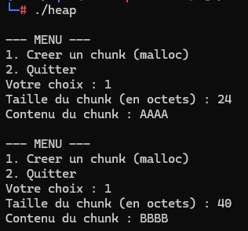

#### Heap Spraying

Le Heap Spraying est une technique permettant de faciliter l'exploitation de la Heap, elle intervient généralement avant ou après la découverte d'une exploitation nécéssitant une structure précise de cette dernière. Lorsqu'un attaquant a besoin de rediriger le flux d'exécution ou d'aligner dans un certain ordre des blocs (chunks), celui-ci peut allouer une quantité massives de blocs afin de remplir les potentiels trous entre les chunks et ainsi pouvoir ensuite allouer à la chaîne ses blocs malveillants. 

L'attaquant peut aussi allouer une quantité immense de blocs remplis de NOP sleds ainsi que de shellcodes, en remplissant la Heap de cette façon, l'attaquant s'assure aussi qu'une adresse arbitraire fixe pointera presque à coup sûr au milieu de l'un de ces blocs, tombant ainsi sur un NOP sled qui glissera jusqu'au ou l'un des shellcodes.

Afin de faire une démonstration de cette technique, voici un programme C disposant d'un menu qui nous propose soit de créer un chunk d'une taille X et contenant une valeur Y, soit de fermer proprement le programme :

```
#include <stdio.h>
#include <stdlib.h>

int main() {
    int choix = 0;
    size_t taille = 0;
    char *bloc = NULL;

    while (1) {
        printf("\n--- MENU ---\n");
        printf("1. Creer un chunk (malloc)\n");
        printf("2. Quitter\n");
        printf("Votre choix : ");
        fflush(stdout);

        if (scanf("%d", &choix) != 1) {
            while (getchar() != '\n');
            continue;
        }

        if (choix == 2) {
            break;
        } else if (choix == 1) {
            printf("Taille du chunk (en octets) : ");
            fflush(stdout);
            if (scanf("%zu", &taille) != 1 || taille == 0) {
                while (getchar() != '\n');
                continue;
            }

            bloc = (char *)malloc(taille);
            if (bloc == NULL) {
                printf("[-] Echec de l'allocation.\n");
                return 1;
            }

            printf("Contenu du chunk : ");
            fflush(stdout);
            scanf(" %s", bloc);

            printf("[+] Stocke : %s\n", bloc);
        } else {
            printf("Option invalide.\n");
        }
    }

    return 0;
}
```

Nous allons commencer par allouer deux chunks :



Nous allons maintenant regarde l'état de la Heap ainsi que l'emplacement de nos chunks dans cette dernière, cela peut se faire via gdb : 

`gdb ./heap -ex "r"`

Nous allons à nouveau allouer deux chunks mais cette fois-ci via gdb, une fois ces deux chunks alloués nous allons effectuer un Ctrl+C pour reprendre la main avec gdb, puis tapper la commande : 

`heap chunks`

Cette dernière permet de voir l'état de la heap ainsi que l'entiereté des chunks alloués s'y trouvant à l'instant t.
